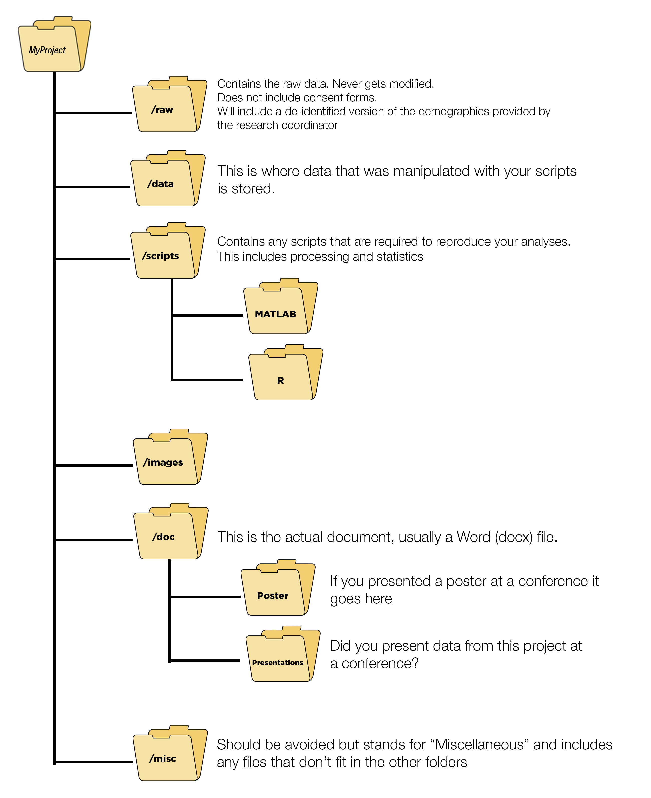

---
output:
  pdf_document: default
  html_document: default
---
# Installation {#installation}

## Starting Off
This is, in my opinion, by far the most frustrating part about learning R. Getting setup is a bit of a pain. But once you are setup things work very well. I am going to do my best to walk you through all the things you need. This should take you about 2 hours to complete. It sucks, but just do it and then were off to the races. 

There's some documentation over on my [GitHub](https://github.com/alapo/thesisUC) which should help a bit.

## Setting up RStudio for the first time


## Installing R + RStudio
This might be the most frustrating part. It can be a bit tricky and takes time to setup. It should take about an hour to accomplish (assuming you have decent internet speeds)

## Already have R and RStudio installed? 

To check which version of R you are running simply type `version` in the **Console**

```{r, eval=TRUE, fig.cap = "Check your R version"}
knitr::include_graphics("https://i.imgur.com/qH9RNAf.png")
```

To check your version of RStudio 

```{r, eval=TRUE, fig.cap = "Check your RStudio version"}
knitr::include_graphics("https://i.imgur.com/kybzMim.png")
```

```{r, eval=TRUE, fig.cap = "Check your RStudio version: Part II"}
knitr::include_graphics("https://i.imgur.com/qJ4eR8r.png")
```

Another method is to use the `rstudioapi` package which allows you to do this via the Console

### How to update R

With some packages it is possible that you will need to update R and/or RStudio (notice that these are different). RStudio is the GUI which runs R. 

If you are using Windows I would highly recommend using the [installr](https://github.com/talgalili/installr) package.

```{r, echo=TRUE, eval=FALSE}
if (!require('remotes')) install.packages('remotes'); # make sure you have Rtools installed first! if not, then run:
#install.packages('installr')
#install.Rtools()
remotes::install_github('talgalili/installr')
```

Launch RGui and then run the following code

```{r, echo=TRUE, eval=FALSE}
if(!require("installr")) install.packages('installr')
library("installr")
updateR() # this will open dialog boxes to take you through the steps.
```

There is apparently a version in development for this to work with [OSX](https://github.com/AndreaCirilloAC/updateR)

```{r, echo=TRUE, eval=FALSE}
install.packages('devtools') #assuming it is not already installed
library(devtools)
install_github('andreacirilloac/updateR')
library(updateR)
updateR(admin_password = 'Admin user password')
```

## Update RStudio

I would highly recommend trying RStudio 1.4. It is currently a preview release. I have been using it for a few months now and some of the new additions are amazing

You can download it [here](https://rstudio.com/products/rstudio/download/preview/)
## Other things to install

1. `tiny_tex`
2. `Biocmanager`
3. List of potential packages

## How to use packages

"packages" include a list of functions that can be used in your code. One of the most widely used packages is the `tidyverse`. In order to use the package we would normally use the `library(packageName)`which in this case would be `library(tidyverse)`.

However, before you can *"load"* a library for the first time it must be installed on your computer. Packages are traditionally downloaded from CRAN, which is an RStudio curated list of packages. Packages on CRAN are tested for stability. You can also download packages directly from GitHub. Packages from GitHub can be (but are rarely) unstable. They can be packages created by anyone, which is one of the main strengths of R.

### Installing packages on your computer

This only needs to be done *ONCE*. 

Install from CRAN you would use the following code

```{r}
install.packages("package1", dependencies = TRUE) # This will install 'package1' on your computer
```

```{r}
install.packages("package2", dependencies = TRUE) # This will install 'package1' on your computer
```

To install from GitHub the `devtools` package is required. Here is a GitHub package called `easystats` which can be found [here](https://github.com/easystats/easystats) on GitHub.

```{r}
install.packages("devtools") # This will install devtools on your computer
library(devtools) # load the 'devtools' library
devtools::install_github("easystats/easystats") # install a package off GitHub using 'devtools'
```

## Alternatives to installing / loading packages

Personally, I find that this approach to installing/loading packages is quite cumbersome. If you have 5 packages here is what your script would look like


```{r}
install.packages("package1", dependencies = TRUE) # This will install 'package1' on your computer
install.packages("package2", dependencies = TRUE) # This will install 'package2' on your computer
install.packages("package3", dependencies = TRUE) # This will install 'package3' on your computer
install.packages("package4", dependencies = TRUE) # This will install 'package4' on your computer
install.packages("package5", dependencies = TRUE) # This will install 'package5' on your computer

library(package1) # This will load 'package1' in your workspace
library(package2) # This will load 'package2' in your workspace
library(package3) # This will load 'package3' in your workspace
library(package4) # This will load 'package4' in your workspace
library(package5) # This will load 'package5' in your workspace
```

An alternative to this would be use the `pacman` package which I fell in love with when I was learning R. Here is the code I have at the top of my scripts. `p_load` This function is a wrapper for library and require. It checks to see if a package is installed, if not it attempts to install the package from CRAN and/or any other repository in the pacman repository list.
For a list of `pacman` functions here:

```{r, eval=TRUE, fig.cap = "List of `pacman` functions"}
knitr::include_graphics("https://i.imgur.com/T8xl8Bi.png")
```

```{r}
if (!require("pacman")) install.packages("pacman")
pacman::p_load(package1, package2, package3, package4, package5) #p_load - This function is a wrapper for library and require. It checks to see if a package is installed, if not it attempts to install the package from CRAN and/or any other repository in the pacman repository list.
```

```{r}
if (!require("pacman")) install.packages("pacman") # This will install/load the 'pacman' package
pacman::p_load(package1, package2) # This will check to see if 'package1' and 'package2' is installed on your computer, otherwise it will install it and then load it.
```

## Trouble installing packages

At times you can have issues installing new packages, this can be for a variety of reasons. 

1. Try closing and re-opening RStudio. At times packages can conflict with each other. Some packages *depend* on other packages to work. For example the `psych` package which requires or *depends* on the `mnormt` package. My first test is to `unload` package which can be done using the code below

```{r}
pacman::p_unload(all) # detaches all packages. Very useful when you need to update a package OR install a packages which has dependencies that are already loaded in your R Session
```

2. You are using a very old version of R
This is rather unlikely, but make sure you are using at least version 4.0 or newer.


If you have conflicting packages see [here](https://www.tidyverse.org/blog/2018/06/conflicted/)

```{r}
conflicted::conflict_prefer("tidy", "broom") # for a given function e.g., tidy(lm) it will prefer the function from tidy before broom
```

## Other things to do in RStudio

### Themes: Bring on the darkness
I typically do a few other small things to setup. The first is I install a dark theme. There are plenty of default themes available but I prefer using one from GitHub called [`rscodeio`](https://github.com/anthonynorth/rscodeio). It's not perfect but its my personal favorite at the moment. I change the color of the cursor to a bright pink as well as the color of syntax highlighting.


```{r}
remotes::install_github("anthonynorth/rscodeio") # install the package
rscodeio::install_theme() # install the theme
```

### Shortcuts

`Ctrl+Alt+L` for *Clear Workspace* this is a shortcut I use a lot to reset my environment

### Code Folding

- [ ] Insert an animation showing how to fold code. 

Code sections allow you to break a larger source file into a set of discrete regions for easy navigation between them. Code sections are automatically foldable—for example, the following source file has three sections (one expanded and the other two folded):

To insert a new code section you can use the `Code -> Insert Section` command. Alternatively, any comment line which includes at least four trailing dashes (-), equal signs (=), or pound signs (#) automatically creates a code section. For example, all of the following lines create code sections:

```{r}
# Section One ---------------------------------
# Section Two =================================
### Section Three #############################
```

There's a couple more examples on StackOverflow [here](https://datascience.stackexchange.com/questions/9681/rules-by-which-rstudio-sets-headings/27499#27499)

Note that as illustrated above the line can start with any number of pound signs (#) so long as it ends with four or more -, =, or # characters.

```{r}
# SECTION1 ---- 

# . Subsection1.1 ----

```
## Conclusion
Now that you have your environment setup, we can finally start with some coding. I would suggest you take a look at my optional chapter on "Project Environment" where we break down where things should be stored in a typical research project. This will come into play if you decide to create a reproducible document using RMarkdown in later chapters. Its also just a good idea to keep things organized so you can find stuff within your project.

## Chapter 1b: Project Environment

Here I give a quick breakdown of a typical project directory.


## Setting up your work environment

### Folder Organization
Check a few of the websites I have bookmarked on this subject

```{r, eval=TRUE}

```

Here is an example from a project where folder structures were not followed. It is an unmitigated disaster.

- https://chrisvoncsefalvay.com/2018/08/09/structuring-r-projects/
- https://www.thinkingondata.com/how-to-organize-data-science-projects/
- https://journals.plos.org/ploscompbiol/article?id=10.1371/journal.pcbi.1000424
- https://drivendata.github.io/cookiecutter-data-science/#opinions
- http://www.theexclusive.org/2012/08/principles-of-research-code.html
- https://martinctc.github.io/blog/rstudio-projects-and-working-directories-a-beginner's-guide/


